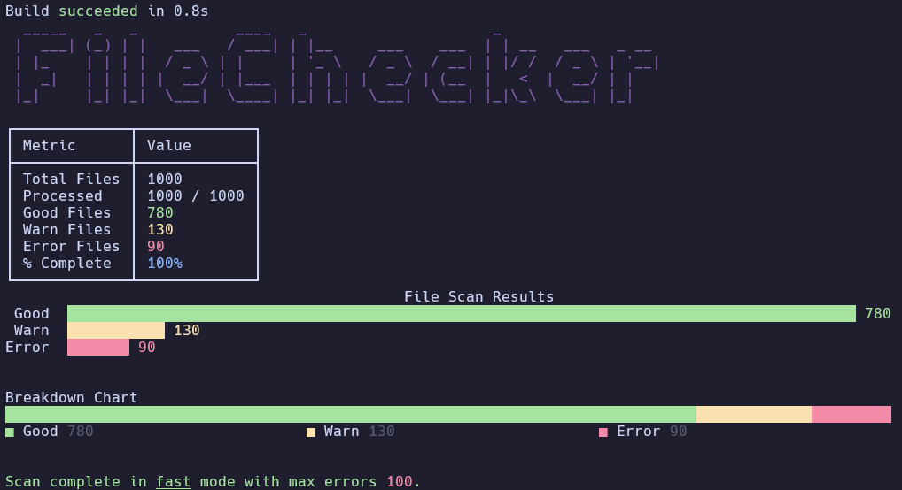

# FileChecker

A simple CLI tool that demonstrates the System.CommandLine beta and the Spectre.CommandLine libraries. 

## Features

* Example of parsing command line args with System.CommandLine
* Example of nice visuals you can create with Spectre.Console

## Usage

```bash
dotnet run -- --max-errors <number> --mode <fast|normal>
```

## Example Output



## Requirements

* .NET 6 or higher
* Spectre.Console

## Installation

1. Clone this repo
2. Run `dotnet restore`
3. Run `dotnet run` as shown above
